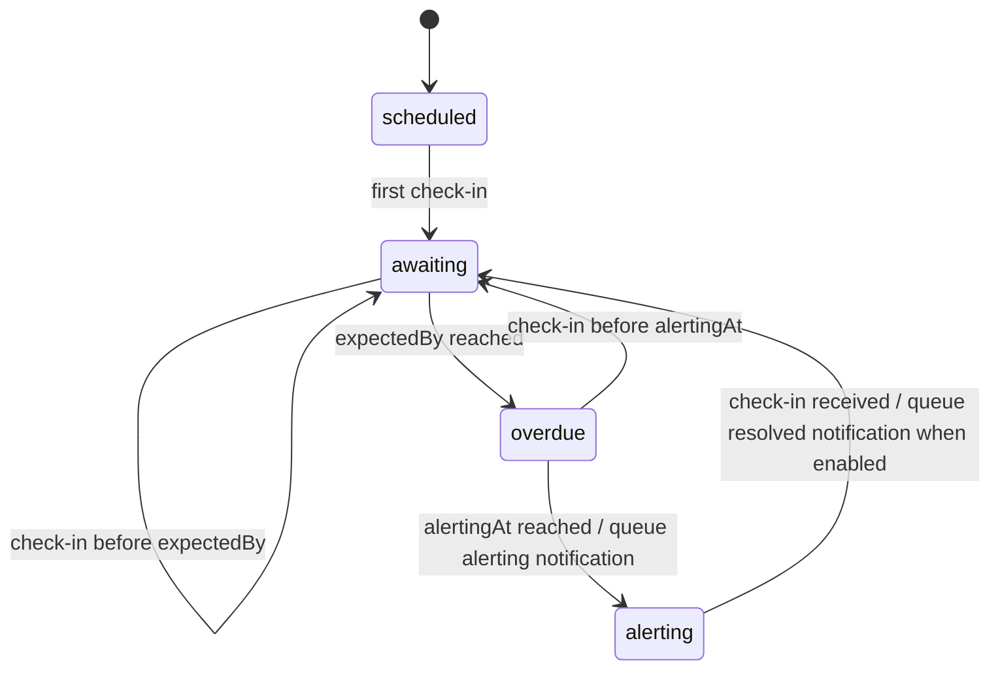

# overdue

[](https://goreportcard.com/report/github.com/containeroo/overdue)
[](https://godoc.org/github.com/containeroo/overdue)
[](https://github.com/containeroo/overdue/releases/latest)
[](https://github.com/containeroo/overdue/releases/latest)

[](https://github.com/containeroo/overdue/actions/workflows/build.yml)
[](LICENSE)

Overdue is a small HTTP check-in monitor.

It exposes one check-in endpoint. As long as something calls that endpoint within the configured interval, the monitor stays healthy. When the expected check-in is missed, Overdue first marks the monitor as overdue. If the check-in still does not arrive before the alerting delay elapses, Overdue sends notifications.

The service is intentionally minimal:

- one check-in monitor
- one configurable check-in route
- JSON status endpoint
- optional bearer-token auth
- webhook notifications
- email notifications
- built-in and custom Go templates

## How it works

Overdue tracks a single check-in monitor with four phases:



| Phase       | Meaning                                                                   |
| ----------- | ------------------------------------------------------------------------- |
| `scheduled` | No check-in has been received yet. No deadline is active.                 |
| `awaiting`  | A check-in was received and the next deadline is scheduled.               |
| `overdue`   | The expected check-in deadline passed. The alerting delay is now running. |
| `alerting`  | The alerting delay passed and an alerting notification was created.       |

The two timing settings are separate:

| Setting            | Meaning                                                  |
| ------------------ | -------------------------------------------------------- |
| `--expected-every` | Maximum allowed time between check-ins.                  |
| `--alerting-delay` | Extra time after the expected deadline before notifying. |

## Quick start

Start Overdue with Docker:

```sh
docker run --rm -p 8080:8080 \
  -e OVERDUE__EXPECTED_EVERY=1m \
  -e OVERDUE__ALERTING_DELAY=10s \
  ghcr.io/containeroo/overdue:latest
```

Send a check-in:

```sh
curl -XPOST http://localhost:8080/checkin
```

Read the current status:

```sh
curl http://localhost:8080/status
```

Read detailed status:

```sh
curl 'http://localhost:8080/status?details=true'
```

Docker Compose and Kubernetes manifests are available in [`deploy/`](deploy/). See [docs/deployment.md](docs/deployment.md) for deployment notes.

## Configuration

Overdue can be configured with CLI flags or environment variables. CLI flags override environment values.

Required settings:

| Flag               | Environment variable      | Description                                                       |
| ------------------ | ------------------------- | ----------------------------------------------------------------- |
| `--expected-every` | `OVERDUE__EXPECTED_EVERY` | Maximum allowed time between check-ins.                           |
| `--alerting-delay` | `OVERDUE__ALERTING_DELAY` | Extra time after the expected deadline before notifications fire. |

Core settings:

| Flag                 | Environment variable        | Default     | Description                                                                |
| -------------------- | --------------------------- | ----------- | -------------------------------------------------------------------------- |
| `--listen-address`   | `OVERDUE__LISTEN_ADDRESS`   | `:8080`     | HTTP server listen address.                                                |
| `--route-prefix`     | `OVERDUE__ROUTE_PREFIX`     | empty       | Path prefix to mount the service under.                                    |
| `--public-url`       | `OVERDUE__PUBLIC_URL`       | empty       | Externally reachable base URL used in notification templates.              |
| `--name`             | `OVERDUE__NAME`           | `default`   | Name of the check-in monitor used in notifications.                        |
| `--path`             | `OVERDUE__PATH`           | `/checkin`  | Route used to receive check-ins.                                           |
| `--start-active`     | `OVERDUE__START_ACTIVE`     | `false`     | Activate the monitor at startup instead of waiting for the first check-in. |
| `--response-details` | `OVERDUE__RESPONSE_DETAILS` | `false`     | Return detailed timing fields from check-in responses by default.          |
| `--auth-token`       | `OVERDUE__AUTH_TOKEN`       | empty       | Optional bearer token required for check-in and status requests.           |
| `--debug`            | `OVERDUE__DEBUG`            | `false`     | Enable debug logging.                                                      |
| `--log-format`       | `OVERDUE__LOG_FORMAT`       | `json`      | Log format: `json` or `text`.                                              |

Environment variables use the `OVERDUE__` prefix. Flag names are uppercased and dashes become underscores.

Dynamic notification flags include the target name:

```text
--name                            -> OVERDUE__NAME
--path                            -> OVERDUE__PATH
--public-url                      -> OVERDUE__PUBLIC_URL
--webhook.ops.url                  -> OVERDUE__WEBHOOK_OPS_URL
--webhook.ops.method               -> OVERDUE__WEBHOOK_OPS_METHOD
--webhook.ops.custom-data          -> OVERDUE__WEBHOOK_OPS_CUSTOM_DATA
--email.primary.smtp-host          -> OVERDUE__EMAIL_PRIMARY_SMTP_HOST
```

See [docs/configuration.md](docs/configuration.md) for the full configuration reference.

## Notifications

Overdue supports multiple named webhook and email notification targets.

Minimal Slack incoming webhook example:

```sh
docker run --rm -p 8080:8080 \
  -e OVERDUE__EXPECTED_EVERY=1m \
  -e OVERDUE__ALERTING_DELAY=10s \
  -e OVERDUE__WEBHOOK_OPS_URL="$SLACK_WEBHOOK_URL" \
  -e OVERDUE__WEBHOOK_OPS_TEMPLATE=builtin:slack-incoming-webhook \
  -e OVERDUE__WEBHOOK_OPS_CUSTOM_DATA=channel=#alertmanager \
  -e OVERDUE__WEBHOOK_OPS_SEND_RESOLVED=true \
  ghcr.io/containeroo/overdue:latest
```

If no notification targets are configured, Overdue still runs and records status, but sends no notifications.

See [docs/notifications.md](docs/notifications.md) for webhook, Slack, and email examples.

## Templates

Notification payloads are rendered with Go templates. Overdue includes built-in templates for HTML email, Slack incoming webhooks, and Slack `chat.postMessage`.

Use a built-in template:

```sh
-e OVERDUE__WEBHOOK_OPS_TEMPLATE=builtin:slack-incoming-webhook
-e OVERDUE__WEBHOOK_OPS_CUSTOM_DATA=channel=#alertmanager
```

Custom templates can be mounted into the container and referenced by path:

```sh
-e OVERDUE__WEBHOOK_OPS_TEMPLATE=/etc/overdue/slack.tmpl
```

Webhook templates must render valid JSON. Email templates may render text or HTML. When `--public-url` is configured, templates can use `.App.Version`, `.App.PublicURL`, `.App.CheckInURL`, and `.App.StatusURL`.

See [docs/templates.md](docs/templates.md) for built-in templates, template data, and helper functions.

## HTTP API

| Method        | Path        | Description                |
| ------------- | ----------- | -------------------------- |
| `GET`, `POST` | `/checkin` | Records a check-in.        |
| `GET`         | `/status`   | Returns the monitor state. |
| `GET`         | `/version`  | Returns build information. |
| `GET`, `POST` | `/healthz`  | Returns a health response. |

The check-in endpoint path is configurable with `--path`. The other routes are mounted under `--route-prefix` when a route prefix is configured.

See [docs/api.md](docs/api.md) for response examples and route prefix details.

## More documentation

- [Configuration](docs/configuration.md)
- [Notifications](docs/notifications.md)
- [Templates](docs/templates.md)
- [HTTP API](docs/api.md)
- [Deployment](docs/deployment.md)
- [Development](docs/development.md)

## License

This project is licensed under the Apache 2.0 License. See the [LICENSE](LICENSE) file for details.


